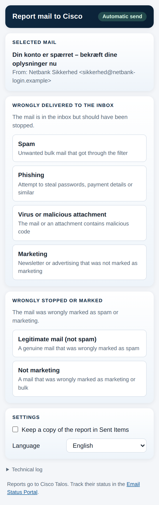
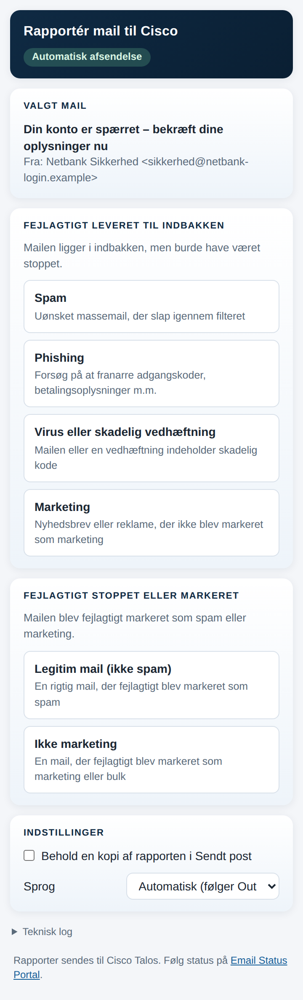

# Cisco Email Security Reporter – a customizable, localized Outlook add-in for reporting spam, phishing and false positives to Cisco Talos

Cisco's own *Secure Email Submission* add-in for Outlook lets users report missed spam,
phishing and marketing mail – and legitimate mail that was wrongly stopped – to Cisco Talos.
Its task pane exists only in English and cannot be changed by the customer, so organisations
that want their users to see the categories in their own language, with their own wording, or
with a copy to their SOC, have had no supported way to get that.

This project is a drop-in alternative. It sends reports to the same Cisco submission addresses
in the same message format (the original mail as a `message/rfc822` attachment), so Talos
processes them exactly like reports from Cisco's add-in and they appear in the
[Talos Email Status Portal](https://talosintelligence.com/email_status_portal). The difference is
that everything the user sees comes from one locale file per language – English, Danish and
Swedish are included – and every behaviour (categories, target folders, extra recipients, send
mode) is a setting. Reports are sent automatically through Microsoft Graph on the user's behalf
with Nested App Authentication: no backend, no client secret, no mail relay. If automatic send
is not available, the add-in opens a pre-addressed message instead and tells the user why.

**Technology stack:** Office.js add-in (add-in only XML manifest, Mailbox 1.6+), plain
HTML/CSS/JavaScript with no build step, self-hosted MSAL.js 4 for Nested App Authentication,
Microsoft Graph `sendMail` and `move`. Static files only – any HTTPS host serves it. Python +
Playwright for the headless smoke test; GitHub Actions for CI and optional GitHub Pages hosting.

**Status:** 1.3.0 – feature complete for English, Danish and Swedish; validated with Microsoft's
manifest validator and a headless smoke test on every commit. Testing automatic send end to end
needs a Microsoft 365 tenant where you can register an Entra app (see Installation).

[](https://github.com/magnusfrodell/cisco-email-security-outlook-addin/actions/workflows/ci.yml)

<p align="center">
  
  
</p>

# Use Case

A Cisco Secure Email (Cloud Gateway, ESA or Threat Defense) deployment gets better the more
users report what the filters missed and what they stopped by mistake: every submission trains
Talos for that customer's mail flow. In practice users only report when the button is where they
are, says what they understand, and costs one click. Cisco's add-in delivers the click but not
the language, and it cannot be adapted to how the organisation talks about mail security.

With this add-in the organisation controls the whole experience:

- The pane, the ribbon button and the store card follow each user's Outlook language, with
  Danish, English and Swedish out of the box and any other language as one added file.
- Six categories map to Cisco's documented addresses – spam, phishing, virus, marketing, and the
  two false-positive categories legitimate and not-marketing – and any of them can be hidden or
  reworded.
- One click sends the report and moves the message to Junk or back to the Inbox; the user never
  sees an outgoing mail.
- The SOC sees what users report: every report can be copied to a SOC mailbox
  (`SOC_ADDRESSES`, Cc or Bcc) with a machine-readable details block, and all submissions can be
  sent *from* the SOC's shared mailbox (`SEND_AS`) so they are tracked under one address in the
  Talos Email Status Portal. Both are administrator settings, invisible to users.
- Everything is visible: a header chip shows the active send mode, a persistent notice explains
  a fallback, and a technical log in the pane gives support staff the whole story.

Challenges solved along the way: legacy Exchange tokens are being retired, so the send path
uses Nested App Authentication and Graph rather than EWS; Graph rejects inline attachments over
3 MB, so larger mails fall back to a new message automatically; and Cisco's message shape
(`orig_msg_*.raw.eml`, `message/rfc822`, the `X-MS-AddIn-Base64Encode` header) is mirrored so
Talos sees a format it already accepts.

Ideas for extending it: Outlook's integrated spam-reporting surface (the native *Report*
button, Mailbox 1.14) as an alternative entry point, a dedicated category for Cisco Secure
Awareness simulated phishing, and more locales.

## Installation

Prerequisites:

- A static HTTPS web host with a valid certificate (Azure Static Web Apps or Storage, IIS,
  nginx, GitHub Pages for demos – anything that serves files).
- Microsoft 365 with Exchange Online mailboxes; Global or Exchange Administrator for central
  deployment; Application Administrator for the Entra app registration.
- For development only: Node.js 18+ (`npm`), Python 3.10+ with Playwright for the smoke test.
- Users on Outlook on the web, new Outlook on Windows, classic Outlook on Windows or Outlook on
  Mac (Microsoft 365). Outlook mobile is not supported.

Clone the repo

```bash
git clone https://github.com/magnusfrodell/cisco-email-security-outlook-addin.git
cd cisco-email-security-outlook-addin
```

Put your HTTPS host into the manifest (the script replaces every `https://addin.example.com`
URL; there is a PowerShell version, `scripts/set-host.ps1`, for Windows)

```bash
scripts/set-host.sh addin.contoso.com
```

Register the Entra app that automatic send uses – SPA redirect URI `brk-multihub://addin.contoso.com`
(origin only, no path), delegated Microsoft Graph permissions `Mail.Send` and `Mail.ReadWrite`,
then grant admin consent. Put its *Application (client) ID* into `src/config.js`:

```javascript
CLIENT_ID: "00000000-0000-0000-0000-000000000000",
AUTHORITY: "https://login.microsoftonline.com/<tenant-id>",
```

Upload everything under `src/` to the root of `https://addin.contoso.com/`, then test by
sideloading: open <https://aka.ms/olksideload>, choose **My add-ins → Add a custom add-in → Add
from file** and pick `src/manifest.xml`. Deploy centrally from the Microsoft 365 admin center
under **Settings → Integrated apps → Upload custom apps** with the same manifest.

Every step in detail, including a shared multi-tenant app registration (one app, admin consent
per customer tenant – the model Cisco's add-in uses), GitHub Pages hosting for demos, updating
and removal: [docs/DEPLOYMENT.md](docs/DEPLOYMENT.md). A Danish version written for the
customer's IT department: [docs/INSTALLATION.da.md](docs/INSTALLATION.da.md).

Without a `CLIENT_ID` the add-in still works: it shows a warning and opens a pre-addressed
message instead of sending. Set `SEND_MODE: "compose"` to make that the intended behaviour
with no warning and no app registration.

## Configuration

All settings are in `src/config.js`; texts are in `src/locales/<lang>.js`. Changes on the web
host take effect the next time a pane opens – no manifest update.

| Setting                          | Default   | What it does                                                                                     |
| -------------------------------- | --------- | ------------------------------------------------------------------------------------------------ |
| `LANGUAGE` / `DEFAULT_LANGUAGE`  | `"auto"` / `"en"` | Follow the user's Outlook language, or force `"da"`, `"en"`, `"sv"`.                     |
| `SHOW_LANGUAGE_SELECTOR`         | `true`    | Let each user pick a language in the pane (stored in their mailbox).                             |
| `SEND_MODE` / `COMPOSE_FALLBACK` | `"graph"` / `true` | Send through Graph; open a new message as the fallback when Graph is unavailable.       |
| `CLIENT_ID` / `AUTHORITY`        | `""` / organizations | Entra app used for Graph; single-tenant or shared multi-tenant.                       |
| `MOVE_AFTER_REPORT`              | `true`    | Move the reported mail to Junk / Inbox after a successful report.                                |
| `SOC_ADDRESSES` / `SOC_COPY_MODE` | `[]` / `"cc"` | Copy of every report to the SOC, visible to Cisco (Cc) or not (Bcc).                       |
| `SEND_AS`                        | `""`      | Submit from a shared (SOC) mailbox instead of the user; needs Send As + `Mail.Send.Shared`.      |
| `CATEGORIES`                     | six       | Cisco address, target folder and `enabled` flag per category; labels live in the locale files.   |

Full reference with recipes: [docs/CONFIGURATION.md](docs/CONFIGURATION.md). Adding a language,
the manifest overrides and every string key: [docs/LOCALIZATION.md](docs/LOCALIZATION.md).

## Usage

For the user: open a message, click **Report to Cisco** (*Rapportér til Cisco* / *Rapportera till
Cisco*) in the ribbon, and choose the category that fits. The pane shows the mail being reported,
the header chip says *Automatic send*, and after a second the status reads e.g. *Reported as
phishing. Sent to phish@access.ironport.com and moved to Junk Email.* The pane can be pinned so it
follows the selection. The language can be changed under *Settings* in the pane.

For the administrator: reports appear under *Submissions* in the
[Talos Email Status Portal](https://talosintelligence.com/email_status_portal) within minutes for
the organisation's domain. Cisco does not send acknowledgement mails. Every pane has a collapsed
**Technical log** at the bottom that records the language decision, the send mode and each step
of a report – the first thing to ask a user for when something looks wrong.

For the developer, there is no build step; `src/` runs as-is:

```bash
npm install                          # validator, dev certs, static server
npm run check                        # node --check on the JavaScript
npm run validate                     # Microsoft's manifest validator
pip install playwright && playwright install chromium
npm test                             # headless smoke test with the Office.js stub
npm run dev-certs && npm run serve   # https://localhost:3000 for sideloading a dev manifest
scripts/set-host.sh localhost:3000 manifest-dev.xml
npm run docs                         # regenerate docs/index.html
```

## Documentation

| Document                                          | Contents                                                        |
| ------------------------------------------------- | --------------------------------------------------------------- |
| [docs/DEPLOYMENT.md](docs/DEPLOYMENT.md)           | Hosting, Entra app registration, sideloading, central deployment |
| [docs/INSTALLATION.da.md](docs/INSTALLATION.da.md) | The same, in Danish, written for the customer's IT department   |
| [docs/CONFIGURATION.md](docs/CONFIGURATION.md)     | Every key in `config.js`, with recipes                          |
| [docs/LOCALIZATION.md](docs/LOCALIZATION.md)       | Locale files, language selection, manifest overrides            |
| [docs/ARCHITECTURE.md](docs/ARCHITECTURE.md)       | How it works, sequence diagrams, function-by-function reference |
| [docs/TROUBLESHOOTING.md](docs/TROUBLESHOOTING.md) | Reading the log, error codes, fixes                             |
| [docs/index.html](docs/index.html)                 | All of the above as one styled, offline HTML file (`npm run docs` rebuilds it) |
| [SECURITY.md](SECURITY.md)                         | What data goes where, permissions                               |

Repository layout:

```text
src/            the deployable add-in (manifest, task pane, config, locales, MSAL, icons)
src/locales/    da.js, en.js, sv.js – one file per language
docs/           documentation (Markdown + generated docs/index.html)
scripts/        set-host.sh / set-host.ps1, build-docs.py
tests/          Office.js stub and headless smoke test
.github/        CI (validate + test) and optional GitHub Pages deployment
```

## Known issues

- Outlook on iOS and Android is not supported: the APIs the add-in relies on
  (`displayNewMessageForm`, `getAsFileAsync`) are not available on mobile.
- Automatic send needs Mailbox 1.14 and Nested App Authentication, i.e. current Microsoft 365
  Outlook builds. Older or perpetual-licence clients get the compose fallback.
- Microsoft Graph rejects inline attachments above about 3 MB in `sendMail`, so larger mails use
  the fallback; Cisco accepts at most 10 MB per submission either way.
- Sideloading custom add-ins can be disabled by tenant policy ("My Custom Apps"); use a test
  tenant or deploy centrally.
- Cisco Secure Awareness simulated-phishing mails are reported as ordinary phishing; Cisco's
  add-in recognises them separately.
- `SEND_AS` applies to automatic send only; when the compose fallback is used the report leaves
  from the user's own mailbox.
- GitHub Pages hosting (the optional workflow) requires a public repository on free GitHub plans.

Issues are tracked in [GitHub Issues](../../issues). Please attach the pane's technical log.

## Getting help

Start with the **Technical log** in the pane and [docs/TROUBLESHOOTING.md](docs/TROUBLESHOOTING.md),
which maps the common `AADSTS` and Graph errors to fixes. If that does not solve it, open a
GitHub issue with the log, the Outlook client and version, and what you expected. This is Cisco
sample code and is not supported by Cisco TAC.

## Getting involved

Contributions are welcome – see [CONTRIBUTING](./CONTRIBUTING.md). Useful areas right now:

- More locales (`src/locales/`), Norwegian and Finnish first.
- Test reports from real Outlook clients (classic Windows, Mac) with automatic send, so the
  client-support table in `docs/ARCHITECTURE.md` reflects experience rather than documentation.
- An integrated spam-reporting variant (Outlook's native *Report* button) as an alternative
  manifest.

The development setup is the same as the installation above plus `npm install` and Playwright
for the smoke test.

## Credits and references

1. Cisco, *Report Spam, Misclassified, Viral Email Messages* (document 214133) – the submission
   addresses and the "send as attachment" requirement this add-in follows.
2. Cisco, *Cisco Secure Email Submission Add-In for Microsoft Outlook* user guide – the
   behaviour this project mirrors (Junk/Inbox moves, keep-a-copy setting, message format).
3. Cisco Talos Email Status Portal – <https://talosintelligence.com/email_status_portal>.
4. Microsoft, *Enable single sign-on in an Office Add-in with nested app authentication*,
   *Office.js Mailbox requirement sets* (`getAsFileAsync`, `displayNewMessageForm`), *Sideload
   Outlook add-ins for testing*, *Microsoft Graph sendMail*.
5. Microsoft Authentication Library for JavaScript (MSAL.js), bundled under the MIT License.

## Licensing info

This code is licensed under the Cisco Sample Code License, Version 1.1. See [LICENSE](./LICENSE)
for details and <https://developer.cisco.com/docs/licenses> for the license text. Third-party
attributions are in [NOTICE](./NOTICE). Copyright (c) 2026 Cisco and/or its affiliates.
