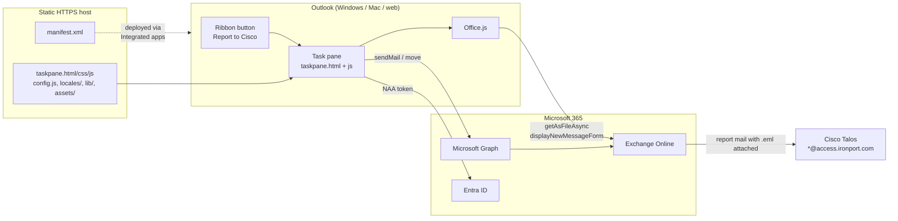
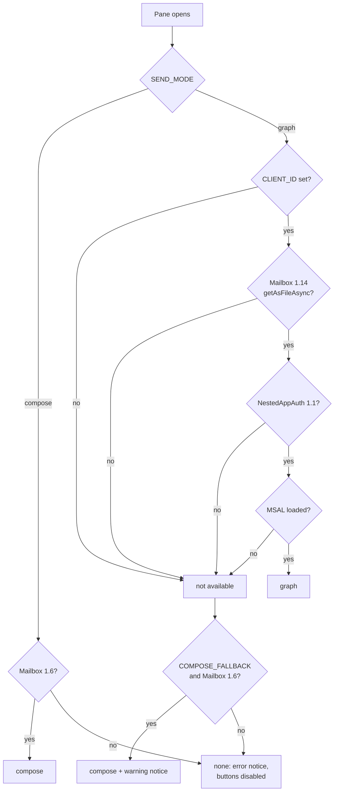
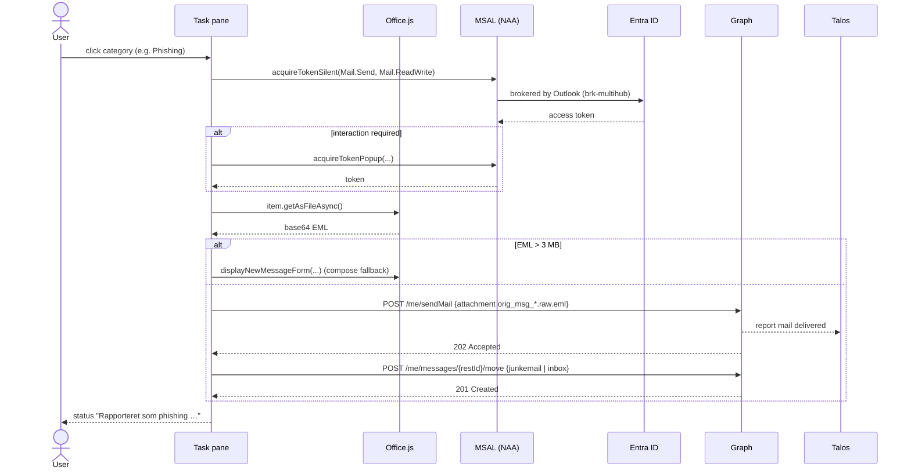
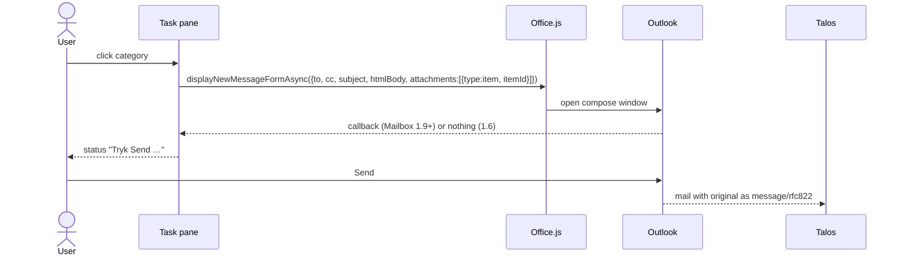

# Architecture and code reference

This document describes how the add-in is put together, how a report travels from Outlook to
Cisco Talos, and what every file and function is for. It is written from the source in `src/`;
if the two disagree, the source wins and this document needs an update.

## 1. Overview

The add-in is a classic Office web add-in: an XML manifest that adds a button to the message
read ribbon, and a static web page (HTML/CSS/JS) that Outlook loads in a task pane. There is no
backend and no build step. Everything under `src/` is deployed unchanged to any HTTPS web host.



A report is always an **e-mail with the original message attached as `message/rfc822`**, sent
from the user's own mailbox to one of Cisco's submission addresses. That is exactly what Cisco's
own *Secure Email Submission* add-in does under the hood, and what Cisco's documentation asks
for when submitting manually. Talos therefore processes reports from this add-in like any other.

## 2. Send modes

Graph is the configured default (`SEND_MODE: "graph"`). `detectMode()` decides when the pane
opens whether it can run, shows the result in the header chip, and – if it has to fall back –
explains why in a persistent notice under the header.



| Mode        | What happens                                                                                                                                                    | Needs                                                                     |
| ----------- | --------------------------------------------------------------------------------------------------------------------------------------------------------------- | ------------------------------------------------------------------------- |
| **graph**   | EML fetched with `getAsFileAsync`, sent with Graph `POST /me/sendMail`, message moved with `POST /me/messages/{id}/move`. No user interaction beyond the click. | `CLIENT_ID`, Entra app registration, Mailbox 1.14, NestedAppAuth 1.1      |
| **compose** | `displayNewMessageForm(Async)` opens a new message to Cisco's address with the selected item attached; the user presses Send. The default only with `SEND_MODE: "compose"`; otherwise the fallback. | Mailbox 1.6 (1.9 for the async variant with error reporting) |
| **none**    | Neither is possible (or the fallback is disabled): error notice, buttons disabled.                                                                              |                                                                           |

Runtime fallbacks from graph to compose (only when `state.fallbackOk`, i.e. `COMPOSE_FALLBACK`
is not `false` and Mailbox 1.6 is available):

- the EML is larger than `MAX_GRAPH_ATTACHMENT_BYTES` (default 3 MB, the Graph `sendMail`
  limit for inline attachments) → compose is used automatically and the status explains why;
- token acquisition, `getAsFileAsync` or the Graph call fails → the status shows the error and a
  **Send manually instead** button that runs the compose flow for the same category.

With the fallback disabled both cases end in an error status and no message is opened.

The move step never blocks a report: if `move` fails after `sendMail` succeeded, the report
counts as sent and the status omits the "moved to …" part.

### 2.1 Sequence: graph mode



### 2.2 Sequence: compose mode



## 3. The report message

Both modes produce the same kind of message. In graph mode the payload is built explicitly:

```json
{
  "message": {
    "subject": "Cisco Secure Email submission – Phishing",
    "body": { "contentType": "Text", "content": "…BODY_TEXT…" },
    "toRecipients": [ { "emailAddress": { "address": "phish@access.ironport.com" } } ],
    "ccRecipients": [ … CC_ADDRESSES … ],
    "internetMessageHeaders": [ { "name": "X-MS-AddIn-Base64Encode", "value": "true" } ],
    "attachments": [ {
      "@odata.type": "#microsoft.graph.fileAttachment",
      "name": "orig_msg_k3f9a2qz.raw.eml",
      "contentType": "message/rfc822",
      "contentBytes": "<base64 EML from getAsFileAsync>"
    } ]
  },
  "saveToSentItems": false
}
```

The attachment name pattern, content type and the `X-MS-AddIn-Base64Encode` header are the
ones Cisco's add-in uses, so the message arriving at Talos is indistinguishable in shape.
`saveToSentItems` follows the user's "keep a copy" setting.

In compose mode Outlook builds the message itself from an *item attachment*; when the message
leaves Exchange the attached item is emitted as a `message/rfc822` MIME part, which is the format
Cisco documents for manual submissions ("forward as attachment").

| Category id | Address                       | Move to      |
| ----------- | ----------------------------- | ------------ |
| `spam`      | spam@access.ironport.com      | `junkemail`  |
| `phish`     | phish@access.ironport.com     | `junkemail`  |
| `virus`     | virus@access.ironport.com     | `junkemail`  |
| `ads`       | ads@access.ironport.com       | `junkemail`  |
| `ham`       | ham@access.ironport.com       | `inbox`      |
| `not_ads`   | not_ads@access.ironport.com   | `inbox`      |

## 4. Files

```text
src/
├── manifest.xml          Office add-in manifest (en-US default, da-DK/sv-SE overrides).
│                         Placeholder host addin.example.com.
├── taskpane.html         Pane markup. Every visible text node has data-str="<key>".
├── taskpane.css          Styling; no framework.
├── taskpane.js           All logic (this document, section 5).
├── config.js             Settings and category structure. No user-facing text.
├── locales/da.js         One file per language: name, bodyText, groups, categories, strings.
├── locales/en.js
├── locales/sv.js
├── support.html          Static support page (en/da/sv) referenced by <SupportUrl>.
├── assets/icon-*.png     Ribbon and store icons, 16/32/64/80/128 px.
└── lib/msal-browser.min.js  MSAL.js 4.30.0 (LTS), self-hosted. Loaded always, used in graph mode.
tests/
├── office-stub.js        Fake Office object for browser-only testing.
└── smoke_test.py         Headless Chromium test (Playwright).
scripts/
├── set-host.sh / .ps1    Replace the placeholder host in the manifest.
└── build-docs.py         Build docs/index.html from the Markdown files.
```

Load order in `taskpane.html` matters: `office.js` in `<head>`, then `config.js` (defines
`window.REPORTER_CONFIG`), then every `locales/*.js` (each adds one entry to
`window.REPORTER_LOCALES`), then `lib/msal-browser.min.js` (defines the `msal` global), then
`taskpane.js`. `taskpane.js` reads config and locales once at load; changing them on the host
takes effect the next time a pane opens.

## 5. `taskpane.js` reference

The file is a single IIFE. Nothing is exported; everything is reachable only through the DOM
events it attaches. Global state lives in one object:

```javascript
var state = {
  mode: "compose",      // "graph" | "compose" | "none", decided by detectMode()
  modeDetected: false,  // detectMode() has run (the chip shows "starting" before that)
  notice: null,         // { kind, key, reasonKey } – persistent notice under the header, or null
  fallbackOk: false,    // compose may be used as a fallback for graph
  language: null,       // active locale key, e.g. "da"
  msalApp: null,        // lazily created NestablePublicClientApplication
  busy: false,          // a report is in progress; buttons are disabled
  item: null            // Office.context.mailbox.item at last refresh, or null
};
```

Two module-level variables hold the active locale: `L` (the whole locale object) and `S`
(`L.strings`). They are swapped by `applyLocale()`.

### 5.1 Languages and strings

| Function                      | Purpose                                                                                                                                                                                                                 |
| ----------------------------- | ----------------------------------------------------------------------------------------------------------------------------------------------------------------------------------------------------------------------- |
| `languages()`                 | Keys of `REPORTER_LOCALES` – the loaded locale files.                                                                                                                                                                   |
| `matchLanguage(tag)`          | Maps `sv-SE`, `SV`, `da_dk` … to a loaded locale key, first exactly, then by base language. `null` if nothing matches.                                                                                                  |
| `savedLanguage()`             | The user's choice from `roamingSettings` (`"auto"` or a locale key), or `null`.                                                                                                                                         |
| `displayLanguage()`           | `Office.context.displayLanguage`, guarded.                                                                                                                                                                              |
| `resolveLanguage()`           | Precedence: user choice (if the selector is enabled) → `LANGUAGE` unless `"auto"` → Outlook display language → `DEFAULT_LANGUAGE` → first locale. Logs the source.                                                    |
| `t(key, params)`              | Returns `S[key]` with `{name}` placeholders replaced from `params`. Unknown keys return the key itself, so a missing translation is visible rather than fatal.                                                          |
| `labelOf(cat)` / `hintOf(cat)` | Category label and hint from `L.categories[cat.id]`; fall back to the id / empty string.                                                                                                                              |
| `bodyText()`                  | `L.bodyText` – the body of the report mail.                                                                                                                                                                             |
| `applyStrings()`              | Fills every `[data-str]` element from `S` and sets `document.title`.                                                                                                                                                    |
| `applyLocale(code)`           | Switches the pane: sets `L`/`S`/`state.language` and `<html lang>`, then `applyStrings()`, `renderCategories()`, `updateModeChip()`, `renderLanguageSelector()`, `clearStatus()`. Called at startup and on every switch. |
| `renderLanguageSelector()`    | Fills the `<select>` with *Automatic* plus one option per locale (`name`), selects the saved choice, hides the row when the selector is disabled or only one locale is loaded.                                           |
| `initLanguageSelector()`      | On change: saves the value to `roamingSettings`, re-resolves and applies the locale, refreshes the item view.                                                                                                           |

### 5.2 Logging

| Function              | Purpose                                                                                                              |
| --------------------- | -------------------------------------------------------------------------------------------------------------------- |
| `log(level, msg, extra)` | Writes `HH:MM:SS LEVEL msg extra` to the in-pane `<pre id="log">` and to the console with the `[CiscoReporter]` prefix. `extra` is JSON-serialised. Levels: `info`, `warn`, `error`. |
| `errText(e)`          | Normalises an `Error`, MSAL error or string to `Name: code: message`.                                                |

Log messages are English and technical; they are meant for support staff, not end users.
User-facing status text always goes through `t()`.

### 5.3 UI

| Function                 | Purpose                                                                                                              |
| ------------------------ | -------------------------------------------------------------------------------------------------------------------- |
| `setModeChip(text, cls)` | Header chip showing the active send mode.                                                                            |
| `setStatus(kind, text, opts)` | Shows the status box (`ok`, `warn`, `err`, `wait`, `neutral`), optional chip override (`opts.chip`) and optional **Send manually instead** button (`opts.retryCompose = category`). Scrolls the box into view (respects `prefers-reduced-motion`). |
| `clearStatus()`          | Hides the status box; called when the selected item changes.                                                         |
| `setButtonsEnabled(on)`  | Enables/disables all category buttons.                                                                               |
| `updateModeChip()`       | Header chip text from `state.mode`/`state.modeDetected` in the active language.                                       |
| `renderNotice()`         | Shows or hides the persistent notice under the header from `state.notice` (kind, string key, localized reason). Re-run on every language switch. |
| `renderCategories()`     | Clears both group containers, sets the group titles from the locale, and builds one `<button class="btn-cat" data-id=…>` per enabled category with the localized label and hint. Re-run on every language switch. |
| `refreshItem()`          | Reads `Office.context.mailbox.item`, shows subject/sender or the "no mail selected" state. Bound to `ItemChanged` for pinned panes. |

### 5.4 Settings

`keepCopy()` reads the per-user `keepCopy` value from `Office.context.roamingSettings`, falling
back to `SAVE_TO_SENT_DEFAULT`. `initSettings()` wires the checkbox (and the language selector)
and persists changes with `roamingSettings.saveAsync`. `updateSettingsVisibility()` hides the
keep-copy row in compose mode (Outlook's own Send decides what goes to Sent Items there) and
hides the whole panel when neither row is visible.

### 5.5 Sending

| Function                     | Purpose                                                                                                                                                                                                                                                              |
| ---------------------------- | -------------------------------------------------------------------------------------------------------------------------------------------------------------------------------------------------------------------------------------------------------------------- |
| `reportViaCompose(cat, reason)` | Builds the `displayNewMessageForm` parameters (to, cc, subject, HTML body, one `item` attachment with the current `itemId`). Uses the async variant when Mailbox 1.9 is available so failures surface; otherwise the sync call. Returns a promise.                       |
| `getEmlBase64()`             | Promise wrapper around `item.getAsFileAsync`. Resolves with the base64 EML.                                                                                                                                                                                          |
| `getToken(scopes)`           | Creates the MSAL nestable public client on first use (`clientId`, `authority`, `localStorage` cache), then `acquireTokenSilent`; on `InteractionRequiredAuthError` falls back to `acquireTokenPopup`. Any other error propagates.                                    |
| `graphPost(path, token, body)` | `fetch` POST to `https://graph.microsoft.com/v1.0` with bearer token. Non-2xx responses become an `Error` with `.status` and the first 300 characters of the body.                                                                                                     |
| `moveItem(token, folder)`    | Converts the EWS item id with `convertToRestId(…, v2_0)` and posts to `/me/messages/{id}/move` with `destinationId` `junkemail` or `inbox`.                                                                                                                           |
| `reportViaGraph(cat)`        | Orchestrates graph mode: scopes → token → EML → size check (returns `{fallback:true, reason}` if too large) → `sendMail` → optional move → success status. Returns `{fallback:false}` on success.                                                                     |

### 5.6 Orchestration and errors

| Function            | Purpose                                                                                                                                                                                                                                                   |
| ------------------- | --------------------------------------------------------------------------------------------------------------------------------------------------------------------------------------------------------------------------------------------------------- |
| `report(cat)`       | Entry point from a category button. Guards against re-entry (`state.busy`), shows the "sending" status, dispatches to the active mode, handles the graph→compose fallback, and always re-enables the buttons in `finally`.                                  |
| `runGuarded(fn)`    | Same busy/finally discipline for secondary actions (the **Send manually instead** button).                                                                                                                                                                 |
| `friendlyError(e)`  | Maps common failures to user text: consent/`AADSTS65001` → `errConsent`; Graph 401/403 → `errGraphDenied`; `getAsFileAsync` failures → `errGetFile`; anything else → the raw `errText`.                                                                    |

Error strategy in one sentence: every failure ends in a visible status with a way forward,
and the technical detail is in the log, never lost.

### 5.7 Startup

`Office.onReady` → host check → `init()`:

1. log diagnostics (add-in version, host, platform, Office version, display language);
2. stop with an error status if no locale file is loaded;
3. `applyLocale(resolveLanguage())` – strings, group titles, buttons, selector;
4. `initSettings()` – keep-copy checkbox and language selector;
5. `detectMode()` – applies `SEND_MODE`/`COMPOSE_FALLBACK`, logs the reasons if the configured
   mode is not available, sets the notice and the settings visibility;
6. `refreshItem()`;
7. register the `ItemChanged` handler (Mailbox 1.5+) so a pinned pane follows the selection.

## 6. `manifest.xml` reference

| Element                                   | Value / purpose                                                                                                  |
| ----------------------------------------- | ---------------------------------------------------------------------------------------------------------------- |
| `Id`                                      | `8cec0077-122f-4b5b-a7ec-b779f92668c7`. Generate a new GUID if you fork the add-in for another organisation.     |
| `Version`                                 | Four-part, e.g. `1.1.0.0`. Must be bumped for the admin center to accept an update.                              |
| `DefaultLocale`                           | `en-US`. `Description`, group label, button label and tooltip carry `Override` elements for `da-DK` and `sv-SE`; Outlook picks the user's language. `DisplayName` is the same in all languages. See `docs/LOCALIZATION.md`. |
| `AppDomains`                              | The add-in host and `https://login.microsoftonline.com` (interactive MSAL fallback).                             |
| `Requirements` / `bt:Sets`                | Mailbox 1.6 minimum – `displayNewMessageForm` is the floor. Graph mode is detected at runtime, not in the manifest. |
| `FormSettings` → `SourceLocation`         | `taskpane.html`, used by clients that ignore `VersionOverrides` (none in practice, but required by the schema).  |
| `Permissions`                             | `ReadWriteItem`.                                                                                                 |
| `Rule`                                    | `ItemIs Message Read` – the button only appears when reading a message.                                          |
| `VersionOverrides` 1.1 → `MessageReadCommandSurface` | One group (*Email security* / *Mailsikkerhed* / *E-postsäkerhet*) with one `ShowTaskpane` button (*Report to Cisco* / *Rapportér til Cisco* / *Rapportera till Cisco*), `SupportsPinning` true. |
| `Resources`                               | Icons 16/32/80, task pane URL, group label, button label, tooltip – the strings with locale overrides.            |

The manifest is validated in CI with Microsoft's `office-addin-manifest validate`, which also
reports the supported platforms (Outlook on Windows, Mac and web).

## 7. Client support

| Client                                | compose mode | graph mode                                     |
| ------------------------------------- | ------------ | ---------------------------------------------- |
| Outlook on the web                    | yes          | yes                                            |
| New Outlook on Windows                | yes          | yes                                            |
| Classic Outlook on Windows (M365)     | yes          | yes on current builds (Mailbox 1.14 + NAA)     |
| Outlook on Mac (M365)                 | yes          | yes on current builds                          |
| Outlook on iOS / Android              | no – `displayNewMessageForm` and `getAsFileAsync` are not available on mobile | no |
| Perpetual / volume-licensed Outlook   | compose only, if Mailbox 1.6 is met            | no                                             |

Requirement sets used: Mailbox 1.6 (`displayNewMessageForm`), 1.5 (`ItemChanged`, pinning),
1.9 (`displayNewMessageFormAsync`), 1.14 (`getAsFileAsync`), NestedAppAuth 1.1 (MSAL brokering).

## 8. Testing

`tests/office-stub.js` provides just enough of the `Office` global to render the pane in a
normal browser: requirement-set answers (Mailbox 1.15, no NestedAppAuth → compose mode),
`displayLanguage` `da-DK`, a fake selected message, `roamingSettings`,
`displayNewMessageForm(Async)` that records its arguments, and an `ItemChanged` hook.

`tests/smoke_test.py` copies `src/` to a temp directory, swaps the hosted `office.js` for the
stub, and drives the pane with Playwright: automatic language resolution (da-DK → Danish), one
button per enabled category, the language selector (switch to Swedish and English, back to
automatic, choice persisted), the compose flow addressed to the right Cisco address with an
item attachment and localized subject/body, status rendering, button enable/disable on selection
change, and zero JavaScript errors. A second scenario simulates a fully configured deployment
(`CLIENT_ID` set, NestedAppAuth available) and checks that graph mode is selected without a
warning. It can also write the screenshots used in the documentation
(`--screenshots docs/images`).

CI (`.github/workflows/ci.yml`) runs the syntax check, the manifest validator, a version
consistency check and the smoke test on every push and pull request.

Graph mode cannot be exercised without a real Outlook and tenant; see
`docs/DEPLOYMENT.md` step 4 for the sideload procedure.

## 9. Design decisions

- **No backend.** Cisco's add-in also sends from the user's mailbox; adding a relay would add a
  system to secure and a place for reports to get stuck, with no gain.
- **Mirror Cisco's payload.** Same attachment name pattern, content type and custom header, so
  Talos sees the format it already accepts.
- **Graph by default, compose as a visible reserve.** One-click reporting is what users expect
  from Cisco's add-in, so it is the configured default and a missing app registration is
  surfaced as a warning rather than silently degraded. The compose path stays because it needs
  no app registration and works on every supported client – as the fallback, or as the only
  mode for a zero-infrastructure deployment.
- **Self-hosted MSAL.** No CDN dependency, no CSP surprises, and the version is pinned by
  what is in the repository.
- **One locale file per language.** Translating is copying a file; the JavaScript stays
  language-neutral, and the manifest carries the same languages as overrides so ribbon and pane
  agree. Config holds structure (ids, addresses, folders), locales hold words.
